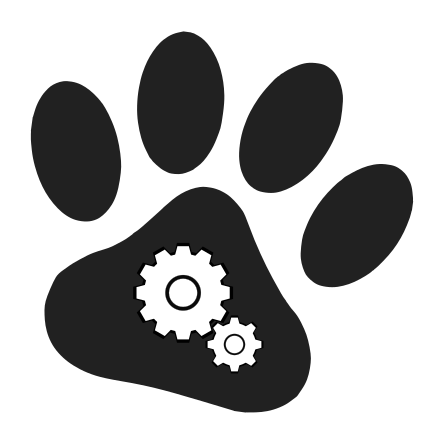

# graphics
Materiais gráficos da comunidade Cadanimal.

## logo

Todos os direitos reservados.

O logo da comunidade Cadanimal foi autorado por [Alexandre Magno](http://github.com/alexandre-mbm). É baseado nos trabalhos de domínio público [engine-153649](http://pixabay.com/pt/motor-engenharia-artes-m%C3%A1quina-153649/) e [paw-296964](http://pixabay.com/pt/pata-gato-orange-pegada-animal-296964/), obtidos sob licença [CC0 1.0](http://creativecommons.org/publicdomain/zero/1.0/deed.pt_BR) no [pixabay](http://pixabay.com).
